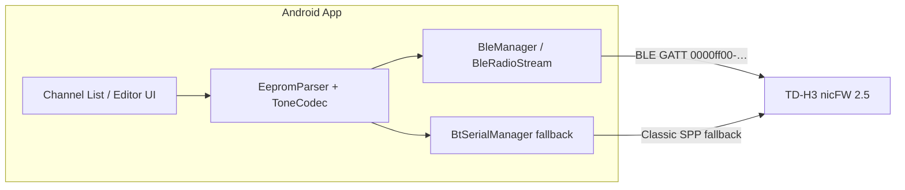

# Android Channel Editor for TD-H3 nicFW V2.5 — Implementation Record

> This document was originally a design plan. It has been updated to reflect what was
> actually built and discovered during implementation (March 2026).

---

## Overview

A fully functional Android app (Kotlin, minSdk 24, targetSdk 35) that edits the 198
memory channels of a TD-H3 radio running nicFW V2.5 firmware over **Bluetooth Low
Energy**. The app reimplements the protocol and EEPROM layout from the companion CHIRP
driver ([../tidradio_h3_nicfw25.py](../tidradio_h3_nicfw25.py)) entirely in Kotlin.

---

## Architecture (as built)



### Key architecture decisions vs. original plan

| Topic | Original plan | What was built |
|---|---|---|
| Bluetooth transport | Classic SPP only | **BLE primary** (matches radio); SPP kept as fallback |
| BLE service UUID | n/a | `0000ff00-0000-1000-8000-00805f9b34fb` (from nicFWRemoteBT) |
| Notify char | n/a | Auto-detected by `PROPERTY_NOTIFY` / `PROPERTY_INDICATE` |
| Write char | n/a | Auto-detected by `PROPERTY_WRITE` / `PROPERTY_WRITE_NO_RESPONSE` |
| Remote mode | n/a | nicFW `0x4a` = enable remote, `0x4b` = disable |
| BLE framing | n/a | `BleRadioStream` buffers writes; `flush()` sends as one GATT write |
| Target SDK | 34 | **35** |

---

## Source layout

```
app/src/main/java/com/nicfw/tdh3editor/
├── MainActivity.kt              # Channel list, BT connect, EEPROM load/save, dump export
├── ChannelEditActivity.kt       # Per-channel editor form
├── ChannelAdapter.kt            # RecyclerView adapter for channel list
├── EepromHolder.kt              # Singleton EEPROM byte array + group labels shared between activities
├── GroupLabelEditActivity.kt    # 15-row editor for group labels A–O
├── bluetooth/
│   ├── BleManager.kt            # BLE scan, GATT connect, BleRadioStream
│   └── BtSerialManager.kt       # Classic SPP fallback
└── radio/
    ├── Channel.kt               # Data class + display helpers (incl. groups, tones)
    ├── EepromConstants.kt       # Lists, offsets, flat tone picker helpers, group label constants
    ├── EepromParser.kt          # Parse / write channel structs + group labels in 8 KB buffer
    ├── Protocol.kt              # BLE/serial protocol (0x45/0x46/0x30/0x31/0x49)
    ├── RadioStream.kt           # Abstract stream interface (BLE and SPP share it)
    └── ToneCodec.kt             # Encode / decode CTCSS and DCS tone words

app/src/main/res/layout/
├── activity_group_label_edit.xml  # Toolbar + scrollable 15-row list + save/cancel buttons
└── item_group_label_row.xml       # Reusable row: letter badge + TextInputEditText (max 6 chars)
```

---

## EEPROM and protocol (implemented)

- **Size**: 8 KB, 256 blocks × 32 bytes each
- **Commands**: `0x45` enter, `0x46` exit, `0x30` read block, `0x31` write block, `0x49` reboot
- **Checksum**: `sum(32 bytes) % 256` — matches Python driver
- **Channel base**: `0x0040`, 198 channels × 32 bytes
- **Frequencies**: stored in 10 Hz units, big-endian u32
- **Settings base**: `0x1900`, magic `0xD82F`
- **Empty channel**: first 4 bytes == `0xFFFFFFFF`
- **Group label table**: `0x1C90`, 15 labels (A–O) × 6 bytes null-padded ASCII

---

## Tone encoding — key discoveries

### CTCSS

Stored as a u16 in units of 0.1 Hz (e.g. 192.8 Hz → 1928 = `0x0788`). Decoding was
straightforward; display bugs were purely a UI issue (see below).

### DCS — octal storage convention (confirmed from live EEPROM dump)

The radio stores DCS codes as **the decimal integer value of their octal label**:

| CHIRP label | Octal value | Decimal stored | EEPROM word |
|---|---|---|---|
| DCS 023 | 023₈ | 19 | `0x8013` |
| DCS 754 | 754₈ | 492 | `0x81EC` |

`ToneCodec` fix:
```kotlin
// decode: 19 → "13" (base-8) → 23 (CHIRP label shown to user)
val chirpCode = raw9.toString(8).toInt()

// encode: 23 → "23".toInt(8) → 19 (stored in EEPROM)
val code = value.toInt().toString().toInt(8)
```

Bit layout of the u16 tone word:
- Bit 15 set → DCS (vs CTCSS when clear and value 1–3000)
- Bit 14 set → polarity R (inverted), clear → polarity N (normal)
- Bits 8–0 → 9-bit DCS code (octal-as-decimal)

---

## UI — tone spinner redesign

### Problem: Android Spinner adapter-swap race condition

The original 3-spinner design (Mode + Value + Polarity) suffered a race condition:

1. `setAdapter(newAdapter)` sets internal `mDataChanged = true`
2. `setSelection(n)` posts a `SelectionNotifier` runnable
3. While `mDataChanged` is true the runnable **re-posts itself** on every pass until
   the Choreographer vsync layout traversal clears the flag
4. By then `initializingTone = false` had already been cleared, so the mode spinner's
   post-layout `selectionChanged()` called `applyToneValueAdapter()`, which swapped the
   adapter back to a fresh instance and reset the selection to index 0 (= 67.0 Hz)

A `lastMode` guard reduced the window but could not fully close it.

### Solution: flat-list spinner (247 items, no adapter swapping)

Each tone side (TX / RX) now has **one** spinner with a fixed adapter:

| Index range | Contents |
|---|---|
| 0 | None |
| 1 – 38 | CTCSS 67.0 Hz … CTCSS 250.3 Hz |
| 39 – 142 | DCS 023 N … DCS 754 N |
| 143 – 246 | DCS 023 R … DCS 754 R |

`setSelection()` on a fixed adapter is safe — no adapter replacement means no race
condition. Helper functions in `EepromConstants`:

```kotlin
fun toneToIndex(mode, value, polarity): Int   // Channel → spinner index
fun indexToTone(idx): Triple<…>               // Spinner index → Channel fields
```

---

## Features implemented

### Channel list (MainActivity)
- Loads all 198 channels from radio EEPROM over BLE
- RecyclerView with card per channel showing:
  - Channel number
  - RX frequency (MHz)
  - Channel name
  - **Active group labels** (e.g. "All  MURS" — resolved from EEPROM labels, hidden when all None)
  - **TX / RX tone** (CTCSS Hz or DCS code+polarity — hidden when no tone is set)
  - Duplex offset (`+600kHz`, `-600kHz`, `Split`, or blank)
- Tap a channel card to open the channel editor

### Channel editor (ChannelEditActivity)
- RX frequency, duplex mode, offset / TX frequency
- Channel name (12 chars)
- Power level (N/T or 1–255)
- Modulation (Auto / FM / AM / USB)
- Bandwidth (Wide / Narrow)
- TX Tone flat spinner (None + 38 CTCSS + 104 DCS-N + 104 DCS-R)
- RX Tone flat spinner (same 247-item list)
- **Group 1–4 spinners** — 2×2 grid; each shows "None" or "A – All", "B – MURS" etc.
  (label text sourced live from `EepromHolder.groupLabels`)
- Raw EEPROM debug line (hex word, 9-bit field, octal) for tone verification

### Channel groups
- Each channel has up to 4 group slots (A–O or None), stored as letter codes in the EEPROM
- Group labels (max 6 chars each) are stored at `0x1C90` in the EEPROM (15 × 6 bytes ASCII)
- `EepromParser.parseGroupLabels()` reads them after load; `writeGroupLabels()` saves edits
- `EepromHolder.groupLabels` (15-item list) is populated on load and updated by the Group Label Editor
- **Channel list** resolves letters → labels at bind time in `ChannelAdapter.buildGroupsDisplay()`
- **Channel editor** spinner items show "A – All" format; selection index maps to `GROUPS_LIST` entry

### Group Label Editor (GroupLabelEditActivity)
- Opened via **⋮ overflow menu → Edit Group Labels…** (disabled until EEPROM is loaded)
- 15 rows (A–O), each with a letter badge and a 6-char `TextInputEditText`
- Pre-populated from `EepromHolder.groupLabels` on open
- On Save: calls `EepromParser.writeGroupLabels()` to patch the in-memory EEPROM buffer,
  updates `EepromHolder.groupLabels` so the rest of the app sees new labels immediately,
  and shows a toast reminding the user to upload to radio to persist

### Bluetooth connect (MainActivity)
- **Scan for Radio (BLE)** — scans for the nicFW BLE service UUID, connects via GATT,
  auto-detects notify and write characteristics
- **Paired Devices (Classic BT)** — fallback SPP connect from paired device list

### EEPROM dump export (MainActivity overflow menu)
- "Save EEPROM dump…" saves:
  - Raw `tdh3_eeprom_<timestamp>.bin` (8 KB)
  - Tone analysis `tdh3_tones_<timestamp>.txt` (per-channel hex + decoded tones)
- Shared via Android share sheet using `FileProvider`

---

## Bugs fixed during implementation

| # | File | Bug | Fix |
|---|---|---|---|
| 1 | `EepromParser.kt` | `readU32Be` returned `Int` (overflow on high frequencies) | Added `.toLong()` to each term |
| 2 | `EepromParser.kt` | Duplex detection inverted (`txf > rxf` gave `"-"` instead of `"+"`) | Swapped `"+"` / `"-"` assignment |
| 3 | `EepromParser.kt` | `writeChannel` for split duplex wrote `offsetHz` instead of `freqTxHz` | Changed to write `c.freqTxHz` |
| 4 | `Protocol.kt` | `write(Byte)` ambiguous in Kotlin 2.0+; compile error | Changed `.toByte()` calls to plain `Int` values |
| 5 | `BtSerialManager.kt` | Missing `@SuppressLint("MissingPermission")` on `pairedDevices()` | Added annotation |
| 6 | `ToneCodec.kt` | DCS decode returned raw decimal (19) not CHIRP label (023) | `raw9.toString(8).toInt()` conversion |
| 7 | `ToneCodec.kt` | DCS encode did not convert octal label to stored decimal | `value.toInt().toString().toInt(8)` conversion |
| 8 | `ChannelEditActivity.kt` | Spinner adapter-swap race reset CTCSS/DCS selection to index 0 | Replaced 3-spinner design with flat 247-item spinner |

---

## Permissions (AndroidManifest.xml)

| Permission | Purpose |
|---|---|
| `BLUETOOTH_SCAN` | BLE device scan (Android 12+) |
| `BLUETOOTH_CONNECT` | GATT connect (Android 12+) |
| `BLUETOOTH` | Classic BT (Android < 12) |
| `BLUETOOTH_ADMIN` | Classic BT (Android < 12) |
| `ACCESS_FINE_LOCATION` | Required for BLE scan (Android < 12) |
| `WRITE_EXTERNAL_STORAGE` (maxSdk 28) | EEPROM dump save (Android ≤ 9) |

`FileProvider` authority: `${applicationId}.fileprovider`

---

## Build

```bash
cd AnroidNICFW_CH_EDITOR
JAVA_HOME="/c/Program Files/Android/Android Studio/jbr" ./gradlew assembleDebug
# APK → app/build/outputs/apk/debug/app-debug.apk
```

Toolchain: AGP 8.7.3 · Kotlin 2.0.21 · Gradle 9.1 · minSdk 24 · targetSdk 35

---

## Future work

- **Settings editor**: expose key radio settings from the 0x1900 block (squelch,
  Bluetooth name, scan lists, band plans)
- **Upload progress**: per-block progress bar during EEPROM write (currently a
  single indeterminate spinner)
- **Import / export**: read/write `.img` files compatible with the CHIRP driver so
  channels can be transferred between the app and a desktop CHIRP session
- **Release build + signing**: configure a keystore and produce a signed APK / AAB
  for Play Store or direct distribution
