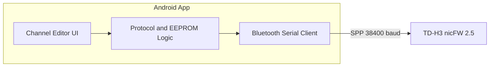

# Android Channel Editor for TD-H3 nicFW V2.5

## Context

- **This repo** provides a Python CHIRP driver ([../tidradio_h3_nicfw25.py](../tidradio_h3_nicfw25.py)): clone-mode read/write of the radio's 8 KB EEPROM over a **serial pipe** (38400 baud, 32-byte blocks, commands 0x45/0x46/0x30/0x31/0x49). Connection is via `radio.pipe` (opened by CHIRP; typically USB serial or "programming mode over BLE" per [../README.md](../README.md)).
- **nicFWRemoteBT** is a separate nicsure project ([nicFWRemoteBT](https://github.com/nicsure/nicfwremotebt)): MAUI app (Android/Windows) that talks to nicFW devices over **Bluetooth serial**. There is no nicFWRemoteBT source in this repo; "use nicFWRemoteBT method" means: connect to the radio via **Bluetooth SPP** (serial profile) the same way that app does.
- **Goal**: An **Android channel editor** that (1) uses **Bluetooth serial** for the link to the radio (nicFWRemoteBT-style), and (2) **leverages** the Python driver by reimplementing its protocol and EEPROM/channel layout so behavior matches CHIRP.

Because the Python driver cannot run as the main app on Android, "leverage" is implemented by **reimplementing the protocol and layout** in Kotlin/Java using the Python driver and [nicfw2docs](https://github.com/nicsure/nicfw2docs) as the single source of truth.

---

## Architecture

- **Android app**: Kotlin (or Java) with minimum SDK ~24; no Python on device.
- **Connection**: Android `BluetoothSocket` with SPP (e.g. `UUID` for Serial Port Profile). Baud rate 38400 and 8N1 must be applied if the radio/BT adapter exposes them; otherwise use the same as nicFWRemoteBT (SPP defaults are often 9600; if the radio accepts 38400 over BT, configure if the API allows).
- **Protocol layer**: Same as [../tidradio_h3_nicfw25.py](../tidradio_h3_nicfw25.py) lines 271–350: enter programming (0x45), read block (0x30 + block index), write block (0x31 + index + 32 bytes + checksum), exit (0x46), reboot (0x49). Block size 32, 256 blocks = 8 KB.
- **EEPROM / channel layout**: Same as driver's `MEM_FORMAT`: VFO A/B at 0x0000/0x0020, 198 channels at 0x0040 (32 bytes each, big-endian), settings at 0x1900 (magic 0xD82F). Frequencies in 10 Hz units; channel struct: rxFreq, txFreq, rxSubTone, txSubTone, txPower, groups, flags (bandwidth, modulation, etc.), name[12].

---

## Implementation Plan

### 1. Android project setup

- Create an **Android application** in this folder (or as a sibling module to the parent repo).
- Use **Kotlin**, **AndroidX**, and **Material**; target SDK 34, min SDK 24.
- Request **Bluetooth** and **Bluetooth Connect** (Android 12+) permissions; optionally **Bluetooth Scan** for discovery.
- No dependency on CHIRP or Python.

### 2. Bluetooth serial connection (nicFWRemoteBT-style)

- Use **Bluetooth Classic** SPP:
  - Either **paired device picker** (list paired devices, user selects the radio) or **scan + pair** then connect.
  - Connect via `BluetoothDevice.createRfcommSocketToServiceRecord(SPP_UUID)` (or the `createRfcommSocket(1)` fallback if the radio uses a non-standard SPP UUID).
- **SPP UUID**: Use standard SPP UUID `00001101-0000-1000-8000-00805F9B34FB` unless nicFWRemoteBT or nicfw2docs specify otherwise (if you have access to nicFWRemoteBT source or nicFW docs, align with that).
- Expose a **stream interface** (e.g. `InputStream` / `OutputStream`) used by the protocol layer with **timeouts** (e.g. 500 ms read timeout to mirror the Python driver).
- Handle disconnect, reconnection, and permission flows in the UI.

### 3. Protocol layer (mirror Python driver)

- Implement in a dedicated package (e.g. `radio.protocol`):
  - **Enter programming**: send `0x45`, expect `0x45` ack.
  - **Exit programming**: send `0x46`, expect `0x46` ack.
  - **Read block** (block 0..255): send `0x30`, `block_num`; read `0x30`, 32 bytes, 1-byte checksum; validate checksum (sum of 32 bytes % 256).
  - **Write block**: send `0x31`, `block_num`, 32 bytes, checksum; expect `0x31` ack.
  - **Reboot**: send `0x49`.
- **Full download**: enter programming, read 256 blocks into an 8 KB buffer, exit programming.
- **Full upload**: enter programming, write 256 blocks from buffer, exit programming, reboot.
- Use the same **checksum** as the driver: `sum(data) % 256` ([../tidradio_h3_nicfw25.py](../tidradio_h3_nicfw25.py) lines 267–268, 299–301, 308–315).
- All I/O goes through the Bluetooth stream abstraction so the protocol code does not depend on Android APIs.

### 4. EEPROM and channel model (mirror Python driver)

- **EEPROM**: 8 KB byte array; parse according to V2.5 layout (big-endian).
- **Channel struct** (32 bytes per channel, starting at 0x0040 for channel 0):
  - Offsets and types as in [../tidradio_h3_nicfw25.py](../tidradio_h3_nicfw25.py) `MEM_FORMAT` (lines 76–91): rxFreq/txFreq (u32, 10 Hz), rxSubTone/txSubTone (u16), txPower (u8), groups (u16), flags (bandwidth, modulation, etc.), reserved[4], name[12].
- **Data classes** (Kotlin): e.g. `Channel` (frequency Rx/Tx, duplex, power, name, mode, bandwidth, CTCSS/DTCS, groups) and **parsers/builders** that convert between byte buffer and `Channel`, matching `_channel_to_memory` / `_memory_to_channel` and `_decode_tone` / `_encode_tone` logic (lines 352–507).
- **Constants**: Reuse driver's lists (e.g. `MODULATION_LIST`, `BANDWIDTH_LIST`, `GROUPS_LIST`, `POWERLEVEL_LIST`, tone encoding) so channel editor behavior matches CHIRP.
- **Empty channel**: First 4 bytes `0xFFFFFFFF` → treat as empty ([../tidradio_h3_nicfw25.py](../tidradio_h3_nicfw25.py) lines 569–571).
- **Settings block**: At 0x1900, magic 0xD82F; optional for a first version (channel-only editor); later can expose key settings (e.g. squelch, Bluetooth on/off) if desired.

### 5. Channel editor UI

- **Connection screen**: Scan/select Bluetooth device; connect; show status (Connected / Disconnected).
- **Download**: "Load from radio" → run full download, parse EEPROM, load channel list into memory.
- **Channel list**: List channels 1–198; show frequency, name, duplex, power; indicate empty slots; tap to edit.
- **Channel edit**: Form for frequency (Rx/Tx or simplex + offset), name (12 chars), power, mode (Auto/FM/AM/USB), bandwidth (Wide/Narrow), CTCSS/DTCS, groups (A–O). Validate frequency in VHF/UHF ranges and name length.
- **Upload**: "Save to radio" → build EEPROM from current channel list (and existing settings block if not edited), then full upload; warn user before overwriting radio.
- **Progress**: Show progress during download/upload (e.g. "Cloning" 1/256 … 256/256) as in the driver's `_do_status`.

### 6. Testing and alignment with Python driver

- **Unit tests**: Use a **mock Bluetooth stream** (e.g. in-memory `ByteArrayOutputStream` / `ByteArrayInputStream`) that replays or records the command/response sequence for download/upload. Optionally use a **prebuilt 8 KB image** (e.g. from [../tests/build_sample_image.py](../tests/build_sample_image.py)) to test EEPROM parsing and channel read/write without a real radio.
- **Cross-check**: Ensure one channel (e.g. 146.52 MHz) parsed in the Android app matches `get_memory(1)` from the Python driver on the same image; same for `set_memory` roundtrip (optional script that compares Python vs Android on the same binary image).

### 7. Documentation and repo layout

- **README**: In this folder document: build (Android Studio / Gradle), permissions, how to pair the TD-H3, that it uses the same protocol as the CHIRP driver and nicFWRemoteBT-style Bluetooth serial.
- **Reference**: Point to parent repo's [../tidradio_h3_nicfw25.py](../tidradio_h3_nicfw25.py) and [nicfw2docs](https://github.com/nicsure/nicfw2docs) for protocol and layout.

---

## Key files to use as spec

| Purpose | Source |
|--------|--------|
| Protocol (commands, block size, checksum) | [../tidradio_h3_nicfw25.py](../tidradio_h3_nicfw25.py) 206–217, 267–320 |
| EEPROM layout (channel struct, settings) | [../tidradio_h3_nicfw25.py](../tidradio_h3_nicfw25.py) 38–201 |
| Channel ↔ memory conversion, tones | [../tidradio_h3_nicfw25.py](../tidradio_h3_nicfw25.py) 352–507, 564–585 |
| Constants (modes, groups, power, steps) | [../tidradio_h3_nicfw25.py](../tidradio_h3_nicfw25.py) 219–253 |
| Test image for parsing tests | [../tests/build_sample_image.py](../tests/build_sample_image.py), [../tests/test_tidradio_h3_nicfw25.py](../tests/test_tidradio_h3_nicfw25.py) |

---

## Open points

- **Baud rate over BT**: The driver uses 38400 on wired serial. Over SPP, the radio or BT chip may fix baud rate; if configurable on the Android side, set 38400 to match; otherwise use device default and rely on nicFW compatibility.
- **nicFWRemoteBT SPP details**: If you can get UUID or connection steps from nicFWRemoteBT source or nicsure docs, align the Android client (UUID, optional pin) for best compatibility.
- **Scope**: Plan above is channel-focused (read/write 198 channels + optional basic settings). Full settings/band plans/scan presets can be added later using the same EEPROM layout from the driver.
